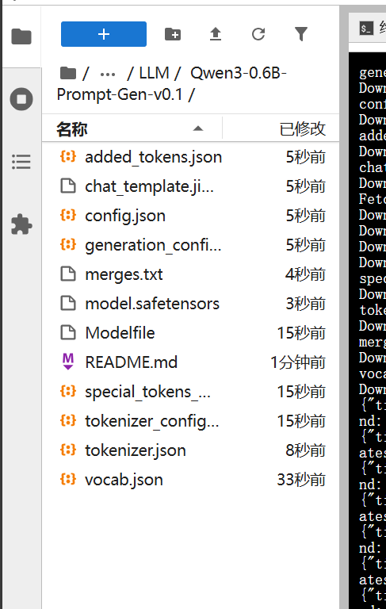

# comfyui-ez-llm

在`models/LLM`文件夹下创建文件夹，例如我这边的` Qwen3-0.6B-Prompt-Gen-v0.1`

并把你从huggingface拿到的所有模型仓库的东西都放进去:

目前不兼容`cuda-malloc`,所以启动参数里加个`--disable-cuda-malloc`,例如`/root/miniconda3/bin/python main.py --port 6006 --disable-cuda-malloc`这样来启动你的comfyui

启动以后这么用：

这边的model_mode三个如果是gemma3系列直接选auto，兼容了gemma3全系列，别的模型(比如gemma2,llama,qwen这种就选text，兼容了所有的纯文本模型，多模态目前只兼容gemma3)

gemma3 1b以上的可以输入图片，这样搞:

感觉没了,有话请给我提issue(
